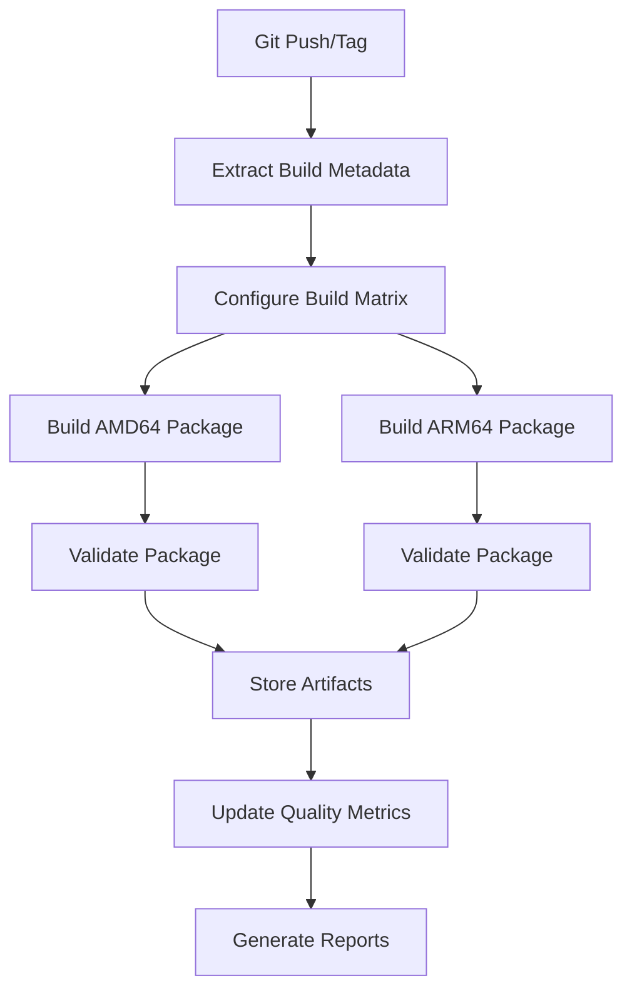
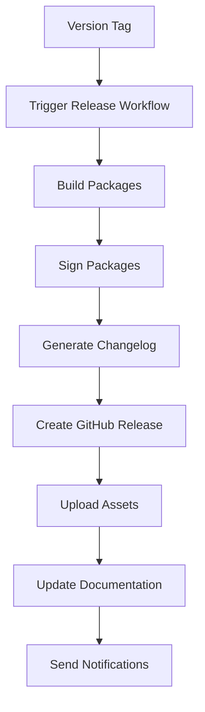

# Data Model: Production CI/CD and APT Package Building

**Feature**: 002-production-ci-cd  
**Created**: 2025-11-01  
**Status**: Design Complete  

## Overview

This document defines the data models, configuration structures, and information flows for the production CI/CD infrastructure. The models support automated package building, validation, and release processes while maintaining compatibility with existing 001-local-rag-mvp structures.

## CI/CD Configuration Models

### Build Configuration Model

```yaml
# .github/workflows/build-packages.yml
name: "Build APT Packages"
on:
  push:
    branches: [main]
  workflow_dispatch:
    inputs:
      architecture:
        description: 'Target architecture'
        required: false
        default: 'all'
        type: choice
        options: ['amd64', 'arm64', 'all']

```yaml
# CI/CD workflow configuration for multi-architecture package building
name: "Build APT Packages"

on:
  push:
    branches: [main]
  pull_request:
    branches: [main]
  workflow_dispatch:

jobs:
  build:
    runs-on: ubuntu-latest
    container:
      image: debian:12
      options: --privileged
    strategy:
      matrix:
        arch: [amd64, arm64]
        include:
          - arch: amd64
            cross_compile: false
            platform: linux/amd64
          - arch: arm64  
            cross_compile: true
            platform: linux/arm64
            
env:
  DEBIAN_FRONTEND: noninteractive
  BUILD_ARCH: ${{ matrix.arch }}
  PACKAGE_NAME: local-rag
  VERSION: ${{ github.ref_name || 'dev' }}
```

### Package Metadata Model

```yaml
# Package information extracted and used across workflows
package:
  name: local-rag
  version: "1.0.0"  # Extracted from git tag or generated
  architecture: [amd64, arm64]
  description: "Local RAG system for private document querying"
  dependencies:
    - python3 (>= 3.11)
    - python3-pip
    - systemd
  conflicts: []
  provides: []
  
build_info:
  timestamp: "2025-11-01T12:00:00Z"
  commit_sha: "abc123def456"
  branch: "main"
  builder: "github-actions"
  cross_compiled: true  # for ARM64 builds
```

### Artifact Management Model

```yaml
# Build artifacts structure and metadata
artifacts:
  packages:
    - name: "local-rag_1.0.0_amd64.deb"
      architecture: amd64
      size_bytes: 1048576
      checksum_sha256: "abc123..."
      build_time_seconds: 180
      validation_status: "passed"
      
    - name: "local-rag_1.0.0_arm64.deb" 
      architecture: arm64
      size_bytes: 1098765
      checksum_sha256: "def456..."
      build_time_seconds: 270
      validation_status: "passed"
      cross_compiled: true
      
  retention:
    branch_builds: 90  # days
    release_builds: permanent
    max_artifacts_per_branch: 50
```

## Validation and Quality Models

### Package Validation Model

```yaml
# Validation pipeline configuration and results
validation:
  lintian:
    enabled: true
    policy_level: "pedantic"
    suppress_tags: []
    required_passes: ["no-errors", "no-warnings"]
    
  installation_test:
    enabled: true
    test_environments:
      - "ubuntu:22.04"
      - "debian:12"
    test_commands:
      - "dpkg -i package.deb"
      - "systemctl --user start local-rag"
      - "curl -f http://localhost:8000/health"
      
  service_validation:
    startup_timeout: 30  # seconds
    health_check_retries: 3
    performance_thresholds:
      memory_max_mb: 512
      startup_time_max_seconds: 30
```

### Quality Metrics Model

```yaml
# Quality tracking and reporting
quality_metrics:
  build_success_rate:
    target: 0.95  # 95%
    window_days: 30
    current: 0.97
    
  validation_metrics:
    lintian_pass_rate: 1.0  # 100%
    installation_success_rate: 1.0
    service_startup_success_rate: 0.98
    
  performance_metrics:
    avg_build_time_amd64: 180  # seconds
    avg_build_time_arm64: 270  # seconds
    cross_compile_overhead: 0.5  # 50%
    
  reliability_metrics:
    mtbf_hours: 720  # Mean time between failures
    recovery_time_minutes: 15
```

## Release Management Models

### Release Configuration Model

```yaml
# Release workflow configuration
release:
  trigger:
    type: "tag"
    pattern: "v*.*.*"
    require_semver: true
    
  automation:
    create_github_release: true
    generate_changelog: true
    attach_packages: true
    sign_packages: true
    
  approval:
    required: false  # Can be enabled for manual approval gates
    reviewers: []
    
  notifications:
    slack_webhook: ""  # Optional
    email_list: []
```

### Release Artifact Model

```yaml
# Release package structure
release:
  tag: "v1.0.0"
  name: "Local RAG v1.0.0"
  draft: false
  prerelease: false
  
  changelog:
    format: "markdown"
    sections:
      - type: "features"
        changes: ["New feature X", "Enhancement Y"]
      - type: "fixes" 
        changes: ["Bug fix Z"]
      - type: "breaking"
        changes: []
        
  assets:
    - name: "local-rag_1.0.0_amd64.deb"
      size: 1048576
      content_type: "application/vnd.debian.binary-package"
      download_count: 0
      
    - name: "local-rag_1.0.0_arm64.deb"
      size: 1098765  
      content_type: "application/vnd.debian.binary-package"
      download_count: 0
      
    - name: "checksums.txt"
      size: 256
      content_type: "text/plain"
      
    - name: "local-rag_1.0.0.deb.asc"  # GPG signatures
      size: 488
      content_type: "application/pgp-signature"
```

## Security and Signing Models

### GPG Configuration Model

```yaml
# GPG signing configuration for package integrity
gpg:
  signing:
    enabled: true
    key_id: "AB123456"
    passphrase_secret: "GPG_PASSPHRASE"  # GitHub secret
    
  verification:
    public_key_url: "https://github.com/user/repo/raw/main/gpg-key.asc"
    keyserver: "keyserver.ubuntu.com"
    
  key_management:
    rotation_days: 365
    backup_required: true
    monitoring: true
```

### Security Scanning Model

```yaml
# Security validation and monitoring
security:
  vulnerability_scanning:
    enabled: true
    tools: ["github-advisory", "safety"]
    fail_on: ["high", "critical"]
    
  dependency_audit:
    python_packages: true
    system_packages: true
    report_format: "sarif"
    
  supply_chain:
    verify_checksums: true
    require_signed_commits: false  # Optional enhancement
    track_provenance: true
```

## Local Development Models

### Local Build Configuration

```yaml
# Configuration for local development builds
local_build:
  script_path: "scripts/build-local.sh"
  
  supported_architectures:
    - amd64
    - arm64
    
  requirements:
    qemu: ">=6.0"  # For cross-compilation
    docker: ">=20.0"  # For clean testing
    lintian: ">=2.100"
    
  configuration:
    parallel_builds: false  # Avoid resource conflicts locally
    cleanup_after_build: true
    verbose_output: true
```

### Development Workflow Integration

```yaml
# Integration with existing TDD workflow
tdd_integration:
  pre_commit_hooks:
    - "scripts/test-quick.sh"
    - "scripts/build-local.sh --validate-only"
    
  ci_simulation:
    script: "scripts/test-ci-local.sh"
    includes_package_build: true
    
  performance_benchmarks:
    include_build_time: true
    track_package_size: true
    validate_cross_compile: true
```

## Monitoring and Observability Models

### Build Monitoring Model

```yaml
# Monitoring configuration for CI/CD pipeline
monitoring:
  metrics:
    build_duration:
      prometheus_metric: "cicd_build_duration_seconds"
      labels: [architecture, branch, result]
      
    success_rate:
      prometheus_metric: "cicd_build_success_rate"
      window: "24h"
      
    artifact_size:
      prometheus_metric: "cicd_artifact_size_bytes"
      labels: [architecture, package_name]
      
  alerting:
    build_failure:
      threshold: 2  # consecutive failures
      channels: ["slack", "email"]
      
    performance_degradation:
      build_time_increase: 50  # percent
      window: "7d"
```

### Log Structure Model

```yaml
# Structured logging for CI/CD operations
logging:
  format: "json"
  level: "info"
  
  fields:
    timestamp: "2025-11-01T12:00:00Z"
    level: "info"
    component: "package-builder"
    operation: "build"
    architecture: "arm64"
    duration_ms: 270000
    result: "success"
    
    context:
      commit_sha: "abc123"
      branch: "main"
      workflow_run_id: "123456789"
      
    metrics:
      package_size_bytes: 1098765
      lintian_warnings: 0
      lintian_errors: 0
```

## Configuration File Locations

### Repository Structure

``` txt
.github/
  workflows/
    build-packages.yml      # Main build workflow
    release.yml             # Release automation
    validate-packages.yml   # Package validation
    
scripts/
  build-local.sh           # Local build simulation
  validate-package.sh      # Package validation script
  
packaging/
  debian/                  # Existing Debian packaging (from 001-local-rag-mvp)
    control
    rules
    install
    postinst
    prerm
    
config/
  ci-cd/
    build-config.yml       # Build configuration
    quality-gates.yml      # Quality thresholds
    monitoring.yml         # Monitoring configuration
```

### Environment Variables

```yaml
# Required environment variables for CI/CD
environment_variables:
  required:
    GITHUB_TOKEN: "GitHub Actions token"
    
  optional:
    GPG_PRIVATE_KEY: "GPG private key for signing"
    GPG_PASSPHRASE: "GPG key passphrase"
    SLACK_WEBHOOK: "Slack notification webhook"
    
  computed:
    BUILD_VERSION: "Extracted from git tag or generated"
    BUILD_TIMESTAMP: "ISO 8601 timestamp"
    COMMIT_SHA: "Git commit hash"
```

## Data Flow Diagrams

### Build Process Data Flow



### Release Process Data Flow



## Integration Points

### Existing System Integration

- **Test Suite**: Quality metrics must include existing 356 test results
- **TDD Workflow**: Local build scripts integrate with `scripts/tdd-*.sh`
- **Performance**: Package build metrics tracked alongside application performance
- **Service Configuration**: Uses existing `config/local-rag.service` systemd file

### External System Integration

- **GitHub Actions**: Primary CI/CD execution environment
- **GitHub Releases**: Package distribution mechanism
- **APT Repositories**: Future integration for professional distribution
- **Monitoring Systems**: Prometheus/Grafana integration capabilities
