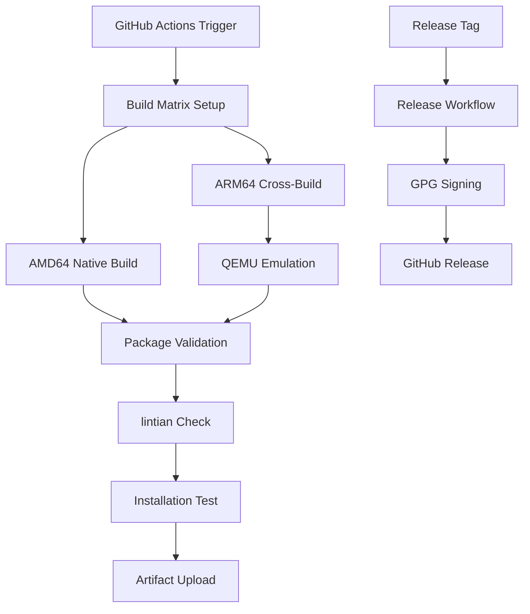

# Implementation Plan: Production CI/CD and APT Package Building

**Feature**: 002-production-ci-cd  
**Created**: 2025-11-01  
**Status**: Planning  

## Overview

This plan details the implementation approach for completing the production CI/CD infrastructure, focusing on automated APT package building for ARM64 and AMD64 architectures. The implementation builds upon the solid foundation established in `001-local-rag-mvp` and follows the existing TDD methodology.

## Implementation Strategy

### Phase 1: Core Package Building Infrastructure (Week 1)

**Objective**: Establish automated APT package building for both target architectures

**Deliverables**:
- GitHub Actions workflow for package building (`build-packages.yml`)
- Cross-compilation support using QEMU emulation
- Basic package validation using lintian
- Build artifact management and retention

**End-to-End Test**: Push code to main branch, verify both ARM64 and AMD64 packages build successfully, pass lintian validation, and upload as artifacts

**Definition of Done**: Packages build for both architectures with basic validation passing

---

### Phase 2: Quality Assurance and Validation (Week 2)  

**Objective**: Implement comprehensive validation and testing infrastructure

**Deliverables**:
- Package installation testing on clean environments
- Service startup and health check validation
- Test coverage validation (>85%) with build failure on non-compliance
- Constitution compliance validation for single systemd service architecture

**End-to-End Test**: Built packages install successfully on clean Ubuntu 22.04 and Debian 12 systems, systemd service starts correctly, existing test suite (356 tests) passes with >85% coverage, end-to-end functionality validated using test_content/ directory

**Definition of Done**: Packages install and run correctly on target platforms with comprehensive validation

---

### Phase 3: Local Development Integration (Week 3)

**Objective**: Provide local development workflow and debugging capabilities

**Deliverables**:
- Local build simulation scripts (Docker-based and native)
- Developer documentation and setup guides
- Integration with existing TDD workflow
- CI/CD troubleshooting tools

**End-to-End Test**: Developer can run local build scripts, produce identical packages to CI, and validate locally before pushing

**Definition of Done**: Complete local development workflow matches CI environment with comprehensive documentation

---

### Phase 4: Release Automation (Week 4)

**Objective**: Automate release creation and package distribution

**Deliverables**:
- Release workflow (`release.yml`) for tagged versions
- GPG signing implementation for package integrity
- GitHub releases integration with automatic asset uploads
- Email notifications for releases and build failures

**End-to-End Test**: Create git tag, verify automated release process creates signed packages, uploads to GitHub releases, and sends notifications

**Definition of Done**: Complete automated release pipeline from tag creation to package distribution

---

### Phase 5: Documentation and Integration (Week 5)

**Objective**: Complete documentation and validate integration with existing codebase

**Deliverables**:
- Comprehensive user installation guides
- Developer documentation for CI/CD maintenance
- Integration testing with existing 001-local-rag-mvp functionality
- Performance monitoring and alerting

**End-to-End Test**: Full end-to-end workflow from development to production deployment, zero regression in existing functionality, complete documentation validated

**Definition of Done**: Production-ready CI/CD infrastructure with complete documentation and validated integration

## Technical Architecture

### Build Environment Design

### Package Building Workflow

1. **Environment Setup**: Configure build dependencies and tools
2. **Source Preparation**: Checkout code and setup build context
3. **Cross-Compilation**: Enable QEMU for ARM64 builds when needed
4. **Package Building**: Execute dpkg-buildpackage with architecture flags
5. **Validation**: Run lintian and basic installation checks
6. **Artifact Storage**: Upload packages with appropriate retention

### Quality Gates

- **Code Quality**: All existing tests must pass
- **Package Validation**: lintian must report no errors
- **Installation Testing**: Clean system installation must succeed
- **Service Verification**: Systemd service must start and pass health checks
- **Performance**: Build time must meet NFR requirements

## Risk Mitigation

### Technical Risks

**Risk**: Cross-compilation failures due to architecture-specific dependencies  
**Mitigation**: Comprehensive dependency analysis and fallback strategies, extensive testing with multiple base images

**Risk**: QEMU emulation performance degradation  
**Mitigation**: Performance benchmarking, build time monitoring, alternative cross-compilation strategies

**Risk**: Package signing key management complexity  
**Mitigation**: Secure key storage using GitHub secrets, key rotation procedures, backup strategies

### Operational Risks

**Risk**: CI/CD pipeline resource consumption  
**Mitigation**: Efficient caching strategies, parallel execution optimization, resource monitoring

**Risk**: Build artifact storage costs  
**Mitigation**: Appropriate retention policies, artifact cleanup automation, cost monitoring

**Risk**: Package repository maintenance overhead  
**Mitigation**: Automated repository management, monitoring and alerting, clear maintenance procedures

## Dependencies and Prerequisites

### Required Infrastructure

- **GitHub Actions**: Must have sufficient runner minutes and storage
- **GPG Keys**: Required for package signing (can be implemented in later phases)
- **Test Environments**: Clean systems for installation validation

### Code Dependencies

- **Existing Packaging**: `packaging/debian/` structure from 001-local-rag-mvp
- **Service Configuration**: `config/local-rag.service` systemd file
- **Test Suite**: Current test infrastructure for quality validation

### External Tool Dependencies

- **dpkg-buildpackage**: For Debian package creation
- **lintian**: For package policy validation  
- **QEMU**: For cross-architecture emulation
- **GPG**: For package signing and verification

## Success Metrics and Validation

### Functional Validation

- [ ] Packages build successfully for both architectures
- [ ] Cross-compilation produces functionally equivalent packages
- [ ] Installation succeeds on clean target systems
- [ ] Service starts and passes health checks
- [ ] Validation tools report no critical issues

### Performance Validation

- [ ] Build pipeline completes within 30-minute target
- [ ] Cross-compilation overhead stays under 50%
- [ ] Package installation completes within 5 minutes
- [ ] Parallel builds execute without conflicts

### Quality Validation

- [ ] 95%+ build success rate maintained
- [ ] Package integrity verified through signatures
- [ ] Zero regression in existing functionality
- [ ] Comprehensive error handling and reporting

## Rollout Strategy

### Development Approach

1. **Branch Creation**: Create `002-production-ci-cd` from current main
2. **Iterative Development**: Implement features following TDD methodology
3. **Integration Testing**: Validate against existing 001-local-rag-mvp functionality
4. **Documentation**: Maintain comprehensive developer and user documentation

### Testing Strategy

- **Unit Tests**: Test individual CI/CD components and scripts
- **Integration Tests**: Validate end-to-end package building and installation
- **Manual Testing**: Verify packages on actual target hardware
- **Performance Testing**: Benchmark build times and resource usage

### Deployment Phases

1. **Alpha**: Basic package building on single architecture
2. **Beta**: Cross-compilation and dual-architecture support
3. **Release Candidate**: Full automation with release workflows
4. **Production**: Complete CI/CD infrastructure with monitoring

## Future Considerations

### Potential Enhancements

- **APT Repository Hosting**: Dedicated package repository for easier installation
- **Multi-Distribution Support**: Extend beyond Ubuntu/Debian to other distributions
- **Container Images**: Docker/Podman container builds alongside APT packages
- **Automated Security Scanning**: Integrate vulnerability scanning into pipeline

### Maintenance Planning

- **Dependency Updates**: Regular updates to build tools and dependencies
- **Security Patches**: Automated security update workflows
- **Performance Optimization**: Continuous improvement of build efficiency
- **Documentation Maintenance**: Keep developer guides current with infrastructure changes
