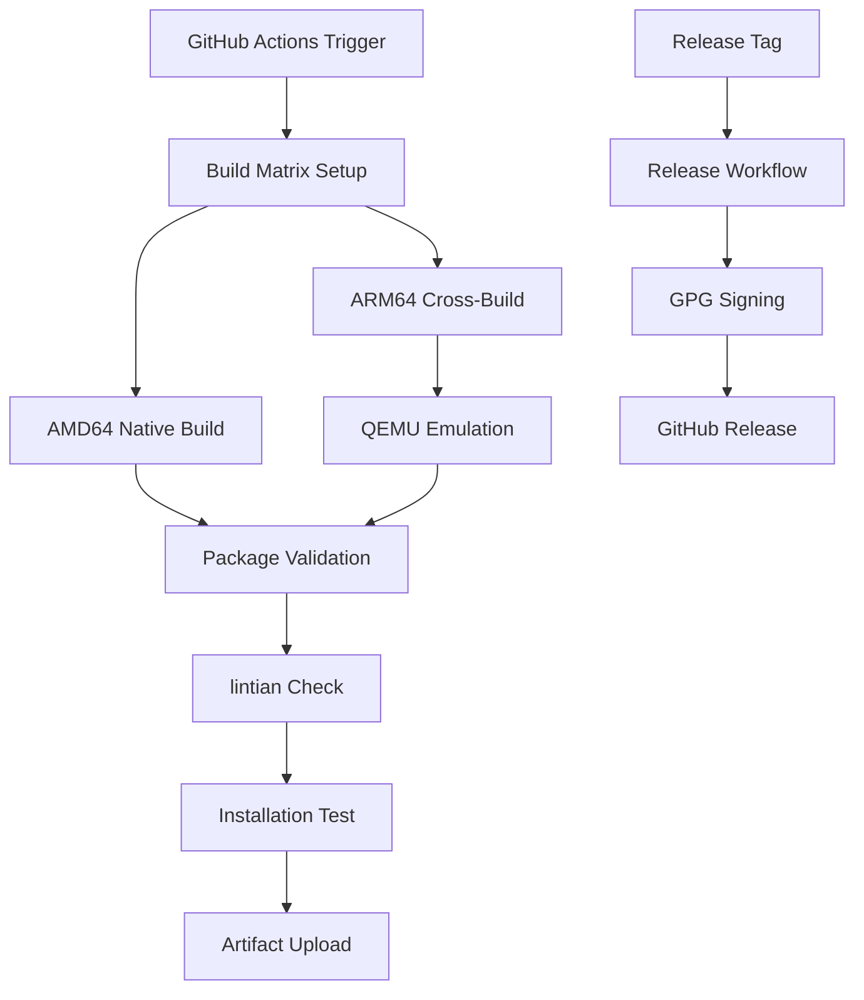

# Implementation Plan: Production CI/CD and APT Package Building

**Feature**: 002-production-ci-cd  
**Created**: 2025-11-01  
**Status**: Planning  

## Overview

This plan details the implementation approach for completing the production CI/CD infrastructure, focusing on automated APT package building for ARM64 and AMD64 architectures. The implementation builds upon the solid foundation established in `001-local-rag-mvp` and follows the existing TDD methodology.

## Implementation Strategy

### Phase 1: Core Package Building Infrastructure (Weeks 1-2)

**Objective**: Establish automated APT package building for both target architectures

**Deliverables**:
- GitHub Actions workflow for package building (`build-packages.yml`)
- Cross-compilation support using QEMU emulation
- Package validation using lintian
- Build artifact management and retention

**Key Components**:
1. **Build Matrix Configuration**: Setup parallel builds for ARM64 and AMD64
2. **Cross-Compilation Environment**: Configure QEMU for ARM64 builds on AMD64 runners
3. **Package Build Scripts**: Implement dpkg-buildpackage automation
4. **Validation Pipeline**: Integrate lintian and basic installation testing

### Phase 2: Release Automation (Week 3)

**Objective**: Automate release creation and package distribution

**Deliverables**:
- Release workflow (`release.yml`) for tagged versions
- GPG signing implementation for package integrity
- GitHub releases integration with automatic asset uploads
- Changelog generation from commit history

**Key Components**:
1. **Release Triggers**: Tag-based workflow activation
2. **Package Signing**: GPG key integration for security
3. **Asset Management**: Automated upload to GitHub releases
4. **Documentation Updates**: Automatic version updating

### Phase 3: Quality Assurance and Testing (Week 4)

**Objective**: Ensure package quality and installation reliability

**Deliverables**:
- Package installation testing on clean environments
- Smoke tests for service functionality
- Performance validation for cross-compilation
- Comprehensive test coverage for CI/CD components

**Key Components**:
1. **Installation Testing**: Clean system validation using containers
2. **Service Verification**: Health check automation post-installation
3. **Performance Benchmarks**: Cross-compilation efficiency metrics
4. **Error Handling**: Robust failure recovery and reporting

### Phase 4: Local Development Integration (Week 5)

**Objective**: Provide local simulation and development workflow optimization

**Deliverables**:
- Local build simulation scripts
- Developer documentation and guides
- CI/CD troubleshooting tools
- Integration with existing TDD workflow

**Key Components**:
1. **Local Build Scripts**: Mirror CI environment locally
2. **Development Tools**: Debugging and validation utilities
3. **Documentation**: Comprehensive developer guides
4. **Workflow Integration**: Seamless TDD methodology support

## Technical Architecture

### Build Environment Design

### Package Building Workflow

1. **Environment Setup**: Configure build dependencies and tools
2. **Source Preparation**: Checkout code and setup build context
3. **Cross-Compilation**: Enable QEMU for ARM64 builds when needed
4. **Package Building**: Execute dpkg-buildpackage with architecture flags
5. **Validation**: Run lintian and basic installation checks
6. **Artifact Storage**: Upload packages with appropriate retention

### Quality Gates

- **Code Quality**: All existing tests must pass
- **Package Validation**: lintian must report no errors
- **Installation Testing**: Clean system installation must succeed
- **Service Verification**: Systemd service must start and pass health checks
- **Performance**: Build time must meet NFR requirements

## Risk Mitigation

### Technical Risks

**Risk**: Cross-compilation failures due to architecture-specific dependencies  
**Mitigation**: Comprehensive dependency analysis and fallback strategies, extensive testing with multiple base images

**Risk**: QEMU emulation performance degradation  
**Mitigation**: Performance benchmarking, build time monitoring, alternative cross-compilation strategies

**Risk**: Package signing key management complexity  
**Mitigation**: Secure key storage using GitHub secrets, key rotation procedures, backup strategies

### Operational Risks

**Risk**: CI/CD pipeline resource consumption  
**Mitigation**: Efficient caching strategies, parallel execution optimization, resource monitoring

**Risk**: Build artifact storage costs  
**Mitigation**: Appropriate retention policies, artifact cleanup automation, cost monitoring

**Risk**: Package repository maintenance overhead  
**Mitigation**: Automated repository management, monitoring and alerting, clear maintenance procedures

## Dependencies and Prerequisites

### Required Infrastructure

- **GitHub Actions**: Must have sufficient runner minutes and storage
- **GPG Keys**: Required for package signing (can be implemented in later phases)
- **Test Environments**: Clean systems for installation validation

### Code Dependencies

- **Existing Packaging**: `packaging/debian/` structure from 001-local-rag-mvp
- **Service Configuration**: `config/local-rag.service` systemd file
- **Test Suite**: Current test infrastructure for quality validation

### External Tool Dependencies

- **dpkg-buildpackage**: For Debian package creation
- **lintian**: For package policy validation  
- **QEMU**: For cross-architecture emulation
- **GPG**: For package signing and verification

## Success Metrics and Validation

### Functional Validation

- [ ] Packages build successfully for both architectures
- [ ] Cross-compilation produces functionally equivalent packages
- [ ] Installation succeeds on clean target systems
- [ ] Service starts and passes health checks
- [ ] Validation tools report no critical issues

### Performance Validation

- [ ] Build pipeline completes within 30-minute target
- [ ] Cross-compilation overhead stays under 50%
- [ ] Package installation completes within 5 minutes
- [ ] Parallel builds execute without conflicts

### Quality Validation

- [ ] 95%+ build success rate maintained
- [ ] Package integrity verified through signatures
- [ ] Zero regression in existing functionality
- [ ] Comprehensive error handling and reporting

## Rollout Strategy

### Development Approach

1. **Branch Creation**: Create `002-production-ci-cd` from current main
2. **Iterative Development**: Implement features following TDD methodology
3. **Integration Testing**: Validate against existing 001-local-rag-mvp functionality
4. **Documentation**: Maintain comprehensive developer and user documentation

### Testing Strategy

- **Unit Tests**: Test individual CI/CD components and scripts
- **Integration Tests**: Validate end-to-end package building and installation
- **Manual Testing**: Verify packages on actual target hardware
- **Performance Testing**: Benchmark build times and resource usage

### Deployment Phases

1. **Alpha**: Basic package building on single architecture
2. **Beta**: Cross-compilation and dual-architecture support
3. **Release Candidate**: Full automation with release workflows
4. **Production**: Complete CI/CD infrastructure with monitoring

## Future Considerations

### Potential Enhancements

- **APT Repository Hosting**: Dedicated package repository for easier installation
- **Multi-Distribution Support**: Extend beyond Ubuntu/Debian to other distributions
- **Container Images**: Docker/Podman container builds alongside APT packages
- **Automated Security Scanning**: Integrate vulnerability scanning into pipeline

### Maintenance Planning

- **Dependency Updates**: Regular updates to build tools and dependencies
- **Security Patches**: Automated security update workflows
- **Performance Optimization**: Continuous improvement of build efficiency
- **Documentation Maintenance**: Keep developer guides current with infrastructure changes
