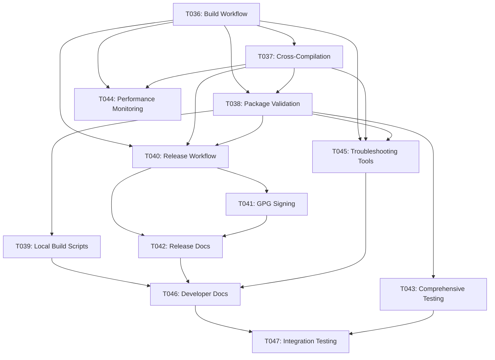

# Tasks: Production CI/CD and APT Package Building

**Feature**: 002-production-ci-cd  
**Created**: 2025-11-01  
**Status**: Planning  

## Task Breakdown by Priority

### Phase 1: Core Package Building Infrastructure (P1)

#### T036: Implement GitHub Actions Package Building Workflow
**Priority**: P1 | **Type**: Implementation | **Estimate**: 3 days  
**Status**: Not Started  

**Description**: Create comprehensive GitHub Actions workflow for automated APT package building supporting both ARM64 and AMD64 architectures.

**Acceptance Criteria**:
- [ ] `.github/workflows/build-packages.yml` created with build matrix for both architectures
- [ ] Workflow triggers on main branch pushes and manual dispatch
- [ ] Parallel builds execute without resource conflicts
- [ ] Build artifacts uploaded with 90-day retention for branches
- [ ] Build logs provide detailed debugging information
- [ ] Integration with existing PR validation workflow

**Dependencies**: Requires existing Debian packaging structure from 001-local-rag-mvp  
**Related**: T037, T038  

---

#### T037: Configure Cross-Compilation with QEMU Emulation
**Priority**: P1 | **Type**: Implementation | **Estimate**: 2 days  
**Status**: Not Started  

**Description**: Implement cross-compilation support for ARM64 packages using QEMU emulation on AMD64 GitHub runners.

**Acceptance Criteria**:
- [ ] QEMU configured for ARM64 emulation in GitHub Actions
- [ ] Cross-compilation produces functionally equivalent packages to native builds
- [ ] Build time overhead stays under 50% compared to native compilation
- [ ] Cross-compiled packages validated on actual ARM64 hardware (Pi5)
- [ ] Fallback mechanisms for emulation failures
- [ ] Performance monitoring and optimization

**Dependencies**: T036 (build workflow foundation)  
**Related**: T038, T040  

---

#### T038: Implement Package Validation Pipeline
**Priority**: P1 | **Type**: Implementation | **Estimate**: 2 days  
**Status**: Not Started  

**Description**: Create comprehensive package validation using lintian and installation testing to ensure package quality and compliance.

**Acceptance Criteria**:
- [ ] lintian validation integrated into build workflow
- [ ] Package installation testing on clean Ubuntu 22.04 and Debian 12 environments
- [ ] Service startup verification and health checks post-installation
- [ ] File permission and ownership validation
- [ ] Dependency resolution testing
- [ ] Validation failure handling and reporting

**Dependencies**: T036 (build workflow), T037 (cross-compilation)  
**Related**: T039  

---

#### T039: Create Local Build Simulation Scripts
**Priority**: P2 | **Type**: Implementation | **Estimate**: 1 day  
**Status**: Not Started  

**Description**: Develop local scripts that mirror the CI build environment for developer testing and debugging.

**Acceptance Criteria**:
- [ ] `scripts/build-local.sh` script created for local package building
- [ ] Architecture selection support (--arch=amd64|arm64)
- [ ] Local QEMU setup for cross-compilation testing
- [ ] Validation pipeline simulation (lintian, installation)
- [ ] Integration with existing TDD workflow scripts
- [ ] Developer documentation for local build process

**Dependencies**: T036, T037, T038 (CI workflows established)  
**Related**: T046  

---

### Phase 2: Release Automation (P2)

#### T040: Implement Automated Release Workflow
**Priority**: P2 | **Type**: Implementation | **Estimate**: 2 days  
**Status**: Not Started  

**Description**: Create automated release workflow that triggers on version tags and handles package distribution.

**Acceptance Criteria**:
- [ ] `.github/workflows/release.yml` created for tag-triggered releases
- [ ] Automatic GitHub release creation with generated changelog
- [ ] Package artifacts attached to releases as downloadable assets
- [ ] Version information extraction from git tags
- [ ] Release draft creation for manual review before publishing
- [ ] Integration with existing package building workflow

**Dependencies**: T036, T037, T038 (core building infrastructure)  
**Related**: T041, T042  

---

#### T041: Configure GPG Package Signing
**Priority**: P2 | **Type**: Implementation | **Estimate**: 1 day  
**Status**: Not Started  

**Description**: Implement GPG signing for package integrity and authenticity verification.

**Acceptance Criteria**:
- [ ] GPG key configuration in GitHub secrets
- [ ] Package signing integrated into build and release workflows
- [ ] Signature verification documentation for end users
- [ ] Key rotation procedures documented
- [ ] Backup key management strategy
- [ ] Automated signature validation in CI

**Dependencies**: T040 (release workflow)  
**Related**: T042  

---

#### T042: Create Release Documentation and User Guides
**Priority**: P2 | **Type**: Documentation | **Estimate**: 1 day  
**Status**: Not Started  

**Description**: Develop comprehensive documentation for release process and package installation.

**Acceptance Criteria**:
- [ ] Installation instructions for APT packages on target platforms
- [ ] GPG key import and verification documentation
- [ ] Release process documentation for maintainers
- [ ] Troubleshooting guide for common installation issues
- [ ] Platform-specific installation notes (Pi5, Ubuntu, Debian)
- [ ] Automated documentation updates in release workflow

**Dependencies**: T040, T041 (release infrastructure)  
**Related**: T039  

---

### Phase 3: Quality Assurance and Monitoring (P3)

#### T043: Implement Comprehensive Package Testing
**Priority**: P3 | **Type**: Testing | **Estimate**: 2 days  
**Status**: Not Started  

**Description**: Create extensive testing infrastructure for package quality validation across multiple environments.

**Acceptance Criteria**:
- [ ] Docker-based clean environment testing for both architectures
- [ ] Smoke tests for service functionality post-installation
- [ ] Performance benchmark validation (startup time, memory usage)
- [ ] Multi-distribution testing (Ubuntu 22.04, Debian 12, Pi OS)
- [ ] Regression testing against previous package versions
- [ ] Automated test reporting and failure analysis

**Dependencies**: T038 (basic validation pipeline)  
**Related**: T044, T045  

---

#### T044: Setup Build Performance Monitoring
**Priority**: P3 | **Type**: Monitoring | **Estimate**: 1 day  
**Status**: Not Started  

**Description**: Implement monitoring and alerting for build performance and success rates.

**Acceptance Criteria**:
- [ ] Build time tracking and trend analysis
- [ ] Success rate monitoring with 95% target threshold
- [ ] Resource usage monitoring (CPU, memory, disk)
- [ ] Cross-compilation performance overhead tracking
- [ ] Alert configuration for build failures and performance degradation
- [ ] Performance dashboard for build metrics

**Dependencies**: T036, T037 (build infrastructure)  
**Related**: T043  

---

#### T045: Create CI/CD Troubleshooting Tools
**Priority**: P3 | **Type**: Tooling | **Estimate**: 1 day  
**Status**: Not Started  

**Description**: Develop debugging and troubleshooting tools for CI/CD pipeline issues.

**Acceptance Criteria**:
- [ ] Build log analysis scripts for common failure patterns
- [ ] Package validation debugging tools
- [ ] Environment reproduction scripts for local debugging
- [ ] CI/CD health check dashboard
- [ ] Automated issue categorization and suggested fixes
- [ ] Integration with existing development workflow

**Dependencies**: T036, T037, T038 (CI/CD infrastructure)  
**Related**: T039, T046  

---

### Phase 4: Documentation and Integration (P3)

#### T046: Complete Developer Documentation
**Priority**: P3 | **Type**: Documentation | **Estimate**: 1 day  
**Status**: Not Started  

**Description**: Create comprehensive developer documentation for CI/CD infrastructure maintenance and extension.

**Acceptance Criteria**:
- [ ] CI/CD architecture documentation with diagrams
- [ ] Workflow maintenance and troubleshooting guides
- [ ] Local development environment setup documentation
- [ ] Contributing guidelines for CI/CD changes
- [ ] Security best practices for build infrastructure
- [ ] Future enhancement roadmap and considerations

**Dependencies**: T039, T042 (tooling and documentation foundation)  
**Related**: T045  

---

#### T047: Integration Testing with Existing Codebase
**Priority**: P3 | **Type**: Testing | **Estimate**: 1 day  
**Status**: Not Started  

**Description**: Validate CI/CD integration with existing 001-local-rag-mvp functionality and TDD workflow.

**Acceptance Criteria**:
- [ ] Zero regression in existing test suite (356 tests must continue passing)
- [ ] TDD workflow scripts integration with new CI/CD infrastructure
- [ ] Performance validation maintains existing benchmarks
- [ ] Service configuration compatibility verified
- [ ] Migration path from development to production deployment validated
- [ ] End-to-end integration testing completed

**Dependencies**: All previous tasks (complete CI/CD infrastructure)  
**Related**: T043  

---

## Task Dependencies Graph

## Sprint Planning

### Sprint 1 (Week 1): Foundation Building
- **T036**: Implement GitHub Actions Package Building Workflow
- **T037**: Configure Cross-Compilation with QEMU Emulation

### Sprint 2 (Week 2): Quality and Local Development
- **T038**: Implement Package Validation Pipeline  
- **T039**: Create Local Build Simulation Scripts

### Sprint 3 (Week 3): Release Automation
- **T040**: Implement Automated Release Workflow
- **T041**: Configure GPG Package Signing
- **T042**: Create Release Documentation and User Guides

### Sprint 4 (Week 4): Quality Assurance and Monitoring
- **T043**: Implement Comprehensive Package Testing
- **T044**: Setup Build Performance Monitoring
- **T045**: Create CI/CD Troubleshooting Tools

### Sprint 5 (Week 5): Integration and Documentation
- **T046**: Complete Developer Documentation
- **T047**: Integration Testing with Existing Codebase

## Risk Assessment by Task

### High Risk Tasks
- **T037**: Cross-compilation complexity may require additional architecture-specific handling
- **T043**: Multi-environment testing may uncover platform-specific issues

### Medium Risk Tasks  
- **T036**: GitHub Actions resource limits may impact build matrix performance
- **T041**: GPG key management requires careful security implementation

### Low Risk Tasks
- **T039**: Local build scripts leverage existing infrastructure
- **T042**: Documentation builds on established patterns from 001-local-rag-mvp

## Success Criteria Summary

**Phase 1 Complete**: Packages build successfully for both architectures with validation  
**Phase 2 Complete**: Automated releases with signed packages available  
**Phase 3 Complete**: Comprehensive quality assurance and monitoring operational  
**Phase 4 Complete**: Full documentation and integration with existing codebase validated
